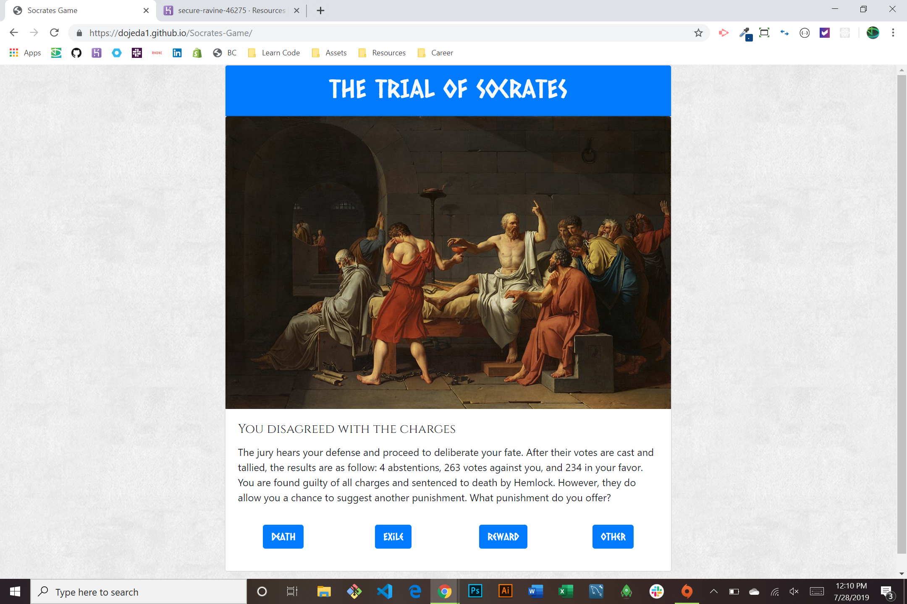

# Trial of Socrates

### About this Project

This is a text based adventure game inspired by the ancient tale of when Socrates was sentenced to death by a jury of his fellow Athenians. Playing as the philosopher himself, you make branching choices powered by IF/ELSE functions in JavaScript that lead to alternate endings. The goal is to find the historical ending or simply explore alternate timelines.

  **Visit Web App [Here!](https://dojeda1.github.io/Socrates-Game/)**

### Technologies used

* HTML
* CSS
* JavaScript
* jQuery
* Bootstrap
